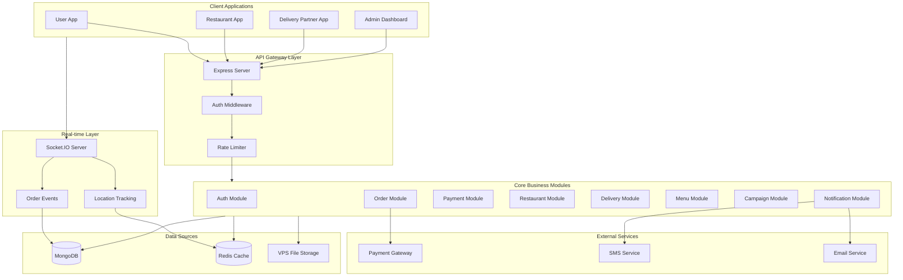
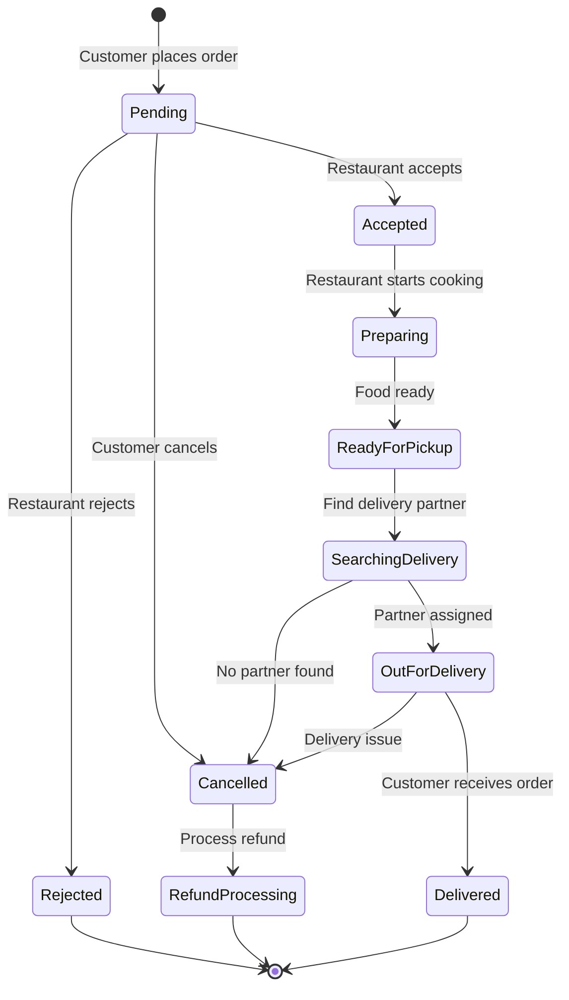

# Backend Architecture Planning Document - AppzetoFood Platform

## 1. System Architecture

### Architecture Choice: **Modular Monolith**

**Justification:**
- **Pros for Modular Monolith:**
  - Simpler deployment on single VPS (as per requirement)
  - Easier transaction management across modules (orders, payments, wallets)
  - Lower operational complexity for team
  - Can extract to microservices later if needed
  - Shared business logic (commission, delivery fee calculations)
  - Faster development and debugging
  
- **Module Structure:**
```
backend/
├── modules/
│   ├── auth/           # Authentication & authorization
│   ├── user/           # User management & preferences
│   ├── restaurant/     # Restaurant management & operations
│   ├── delivery/       # Delivery partner management & gig economy
│   ├── order/          # Order lifecycle & state management
│   ├── payment/        # Payment processing & wallets
│   ├── menu/           # Menu, categories, food items
│   ├── campaign/       # Marketing campaigns & offers
│   ├── notification/   # Push, SMS, email notifications
│   ├── analytics/      # Reports & business intelligence
│   ├── admin/          # Admin operations & configurations
│   ├── subscription/   # Subscription packages
│   └── location/       # Zones, geolocation, distance calculation
├── shared/             # Shared utilities, middleware
├── config/             # Configuration management
└── server.js           # Main entry point
```

### High-Level Architecture Diagram



### Communication Flow

**REST API Flow:**
```
Client → Express Router → Auth Middleware → Rate Limiter → 
Controller → Service Layer → Repository Layer → MongoDB
```

**WebSocket Flow (Real-time):**
```
Client → Socket.IO → Event Handler → Business Logic → 
Redis Pub/Sub → Broadcast to Clients
```

**Background Jobs Flow:**
```
Scheduled Job → Queue Worker → Business Logic → Database Update → 
Notification Trigger
```

## 2. Tech Stack

### Core Framework
- **Backend:** Node.js with Express.js (JavaScript, not TypeScript as specified)

### Database
- **Primary Database:** MongoDB (as specified)
  - Collections approach with proper indexing
  - Aggregation pipelines for analytics

### Supporting Technologies

#### Caching & Session Management
- **Redis:**
  - Session storage
  - Real-time location tracking (geospatial)
  - Order status cache
  - Restaurant availability cache
  - Rate limiting counters
  - Delivery partner online status
  - Popular searches/restaurants cache

#### Message Queue
- **Bull Queue (backed by Redis):**
  - Email sending queue
  - SMS notification queue
  - Order processing queue
  - Payout processing queue
  - Report generation queue
  - Invoice generation queue

#### File Storage
- **VPS Local Storage + Multer:**
  - Restaurant images
  - Food item images
  - User profile pictures
  - Delivery partner documents (ID, license)
  - Invoice PDFs
  - Reports (CSV, PDF, Excel)
  - Organized folder structure: `/uploads/{module}/{year}/{month}/{filename}`

#### Authentication
- **Strategy: JWT-based with Refresh Tokens**
  - Access Token (15 min expiry) - stored in memory/state
  - Refresh Token (7 days expiry) - stored in httpOnly cookie
  - Different token types for different apps (user, restaurant, delivery, admin)
  - OTP-based authentication for phone numbers

#### Key Libraries
```json
{
  "express": "^4.18",
  "mongoose": "^8.0",
  "socket.io": "^4.6",
  "redis": "^4.6",
  "bull": "^4.12",
  "jsonwebtoken": "^9.0",
  "bcryptjs": "^2.4",
  "multer": "^1.4",
  "joi": "^17.11",
  "nodemailer": "^6.9",
  "twilio": "^4.19",
  "razorpay": "^2.9",
  "pdfkit": "^0.13",
  "exceljs": "^4.4",
  "node-cron": "^3.0",
  "winston": "^3.11",
  "helmet": "^7.1",
  "cors": "^2.8",
  "express-rate-limit": "^7.1",
  "express-mongo-sanitize": "^2.2",
  "dotenv": "^16.3",
  "geolib": "^3.3"
}
```

## 3. Database Design

### Core Collections

#### **users**
```javascript
{
  _id: ObjectId,
  name: String,
  email: String (unique, sparse),
  phone: String (unique, required),
  phoneVerified: Boolean,
  password: String (hashed, for email login),
  role: String (enum: 'user'),
  profileImage: String,
  addresses: [{
    _id: ObjectId,
    label: String, // Home, Office, Other
    street: String,
    additionalDetails: String,
    city: String,
    state: String,
    zipCode: String,
    location: {
      type: "Point",
      coordinates: [longitude, latitude]
    },
    isDefault: Boolean
  }],
  paymentMethods: [{
    _id: ObjectId,
    type: String, // card, upi, netbanking, wallet
    details: Object, // encrypted
    isDefault: Boolean
  }],
  preferences: {
    vegMode: Boolean,
    language: String,
    notifications: {
      orders: Boolean,
      offers: Boolean,
      updates: Boolean
    }
  },
  favorites: [{
    restaurantId: ObjectId,
    addedAt: Date
  }],
  wallet: {
    balance: Number (default: 0),
    currency: String (default: 'INR')
  },
  goldMembership: {
    isActive: Boolean,
    startDate: Date,
    endDate: Date
  },
  isActive: Boolean,
  createdAt: Date,
  updatedAt: Date
}
// Indexes: phone (unique), email (unique, sparse), location (2dsphere)
```

#### **restaurants**
```javascript
{
  _id: ObjectId,
  name: String,
  slug: String (unique),
  ownerId: ObjectId (ref: 'users'),
  status: String, // pending, approved, rejected, active, inactive
  
  businessInfo: {
    businessName: String,
    gstNumber: String,
    panNumber: String,
    fssaiLicense: {
      number: String,
      expiryDate: Date,
      document: String
    },
    bankDetails: {
      accountNumber: String (encrypted),
      ifscCode: String,
      accountHolderName: String,
      bankName: String
    }
  },
  
  outlets: [{
    _id: ObjectId,
    name: String,
    address: {
      street: String,
      city: String,
      state: String,
      zipCode: String,
      location: {
        type: "Point",
        coordinates: [longitude, latitude]
      }
    },
    zoneId: ObjectId (ref: 'zones'),
    contactNumbers: [String],
    
    timings: {
      monday: { isOpen: Boolean, slots: [{ open: String, close: String }] },
      tuesday: { isOpen: Boolean, slots: [{ open: String, close: String }] },
      // ... other days
      rushHours: [{ day: String, startTime: String, endTime: String }]
    },
    
    settings: {
      isOnline: Boolean,
      acceptingOrders: Boolean,
      preparationTime: Number, // in minutes
      maxOrdersPerSlot: Number,
      minOrderValue: Number,
      packagingCharges: Number
    },
    
    deliverySettings: {
      selfDelivery: Boolean,
      platformDelivery: Boolean,
      deliveryRadius: Number, // in km
      deliveryFee: Number,
      freeDeliveryAbove: Number
    }
  }],
  
  cuisines: [String],
  categories: [String], // Fast Food, Fine Dining, Cafe, etc.
  priceRange: String, // $, $$, $$$
  
  images: {
    logo: String,
    banner: String,
    gallery: [String]
  },
  
  ratings: {
    average: Number,
    count: Number,
    foodRating: Number,
    deliveryRating: Number,
    serviceRating: Number
  },
  
  commission: {
    percentage: Number, // Platform commission
    type: String // percentage, fixed
  },
  
  subscription: {
    packageId: ObjectId (ref: 'subscriptionPackages'),
    startDate: Date,
    endDate: Date,
    isActive: Boolean,
    autoRenew: Boolean
  },
  
  metrics: {
    totalOrders: Number,
    completedOrders: Number,
    cancelledOrders: Number,
    rejectedOrders: Number,
    averagePreparationTime: Number,
    orderAcceptanceRate: Number
  },
  
  isActive: Boolean,
  verifiedAt: Date,
  createdAt: Date,
  updatedAt: Date
}
// Indexes: slug (unique), ownerId, outlets.location (2dsphere), outlets.zoneId, status
```

#### **menuItems**
```javascript
{
  _id: ObjectId,
  restaurantId: ObjectId (ref: 'restaurants'),
  outletId: ObjectId,
  
  name: String,
  slug: String,
  description: String,
  images: [String],
  
  category: String, // Starters, Main Course, Desserts, Beverages
  subCategory: String,
  
  price: Number,
  discountedPrice: Number,
  
  variants: [{
    name: String, // Small, Medium, Large
    price: Number,
    discountedPrice: Number
  }],
  
  addons: [{
    categoryId: ObjectId (ref: 'addonCategories'),
    name: String,
    price: Number,
    isAvailable: Boolean
  }],
  
  dietary: {
    isVeg: Boolean,
    isNonVeg: Boolean,
    isVegan: Boolean,
    isGlutenFree: Boolean,
    spiceLevel: String // mild, medium, hot
  },
  
  availability: {
    isAvailable: Boolean,
    availableDays: [String], // monday, tuesday, etc.
    availableTime: {
      start: String,
      end: String
    }
  },
  
  nutritionInfo: {
    calories: Number,
    protein: Number,
    carbs: Number,
    fat: Number
  },
  
  tags: [String], // bestseller, new, recommended
  
  metrics: {
    ordersCount: Number,
    rating: Number,
    ratingCount: Number
  },
  
  isActive: Boolean,
  createdAt: Date,
  updatedAt: Date
}
// Indexes: restaurantId, outletId, category, isActive, slug
```

#### **orders**
```javascript
{
  _id: ObjectId,
  orderNumber: String (unique, auto-generated),
  
  customerId: ObjectId (ref: 'users'),
  restaurantId: ObjectId (ref: 'restaurants'),
  outletId: ObjectId,
  deliveryPartnerId: ObjectId (ref: 'deliveryPartners'),
  
  orderType: String, // delivery, dine-in, takeaway
  
  items: [{
    menuItemId: ObjectId (ref: 'menuItems'),
    name: String,
    quantity: Number,
    variant: String,
    addons: [{
      name: String,
      price: Number
    }],
    price: Number,
    itemTotal: Number,
    specialInstructions: String
  }],
  
  pricing: {
    itemsTotal: Number,
    packagingCharges: Number,
    deliveryFee: Number,
    surge: Number,
    tax: {
      cgst: Number,
      sgst: Number,
      total: Number
    },
    discount: {
      couponId: ObjectId,
      couponCode: String,
      amount: Number,
      type: String // flat, percentage
    },
    platformFee: Number,
    tipAmount: Number,
    walletUsed: Number,
    grandTotal: Number
  },
  
  deliveryAddress: {
    street: String,
    additionalDetails: String,
    city: String,
    state: String,
    zipCode: String,
    location: {
      type: "Point",
      coordinates: [longitude, latitude]
    }
  },
  
  restaurantAddress: {
    street: String,
    location: {
      type: "Point",
      coordinates: [longitude, latitude]
    }
  },
  
  status: String, /* 
    pending, 
    accepted, 
    preparing, 
    ready_for_pickup,
    out_for_delivery, 
    delivered, 
    cancelled, 
    rejected 
  */,
  
  statusHistory: [{
    status: String,
    timestamp: Date,
    note: String,
    actor: String // customer, restaurant, delivery, admin, system
  }],
  
  scheduledFor: Date, // for scheduled orders
  
  preparationTime: Number, // estimated by restaurant
  estimatedDeliveryTime: Date,
  actualDeliveryTime: Date,
  
  payment: {
    method: String, // cod, online, wallet
    status: String, // pending, paid, failed, refunded
    transactionId: String,
    paidAt: Date,
    gateway: String, // razorpay, paytm, etc.
  },
  
  commission: {
    restaurantCommission: Number,
    deliveryCommission: Number,
    platformEarnings: Number
  },
  
  cancellation: {
    cancelledBy: String, // customer, restaurant, delivery, admin
    reason: String,
    refundAmount: Number,
    refundStatus: String,
    cancelledAt: Date
  },
  
  tracking: {
    lastKnownLocation: {
      type: "Point",
      coordinates: [longitude, latitude]
    },
    lastUpdated: Date
  },
  
  ratings: {
    food: {
      rating: Number,
      review: String,
      createdAt: Date
    },
    delivery: {
      rating: Number,
      review: String,
      createdAt: Date
    }
  },
  
  notes: String,
  
  createdAt: Date,
  updatedAt: Date
}
// Indexes: orderNumber (unique), customerId, restaurantId, deliveryPartnerId, status, createdAt
```

#### **deliveryPartners**
```javascript
{
  _id: ObjectId,
  name: String,
  email: String,
  phone: String (unique),
  phoneVerified: Boolean,
  
  documents: {
    aadhar: { number: String, document: String, verified: Boolean },
    pan: { number: String, document: String, verified: Boolean },
    drivingLicense: { number: String, document: String, verified: Boolean },
    vehicleRC: { number: String, document: String, verified: Boolean },
    photo: String,
    bankDetails: {
      accountNumber: String (encrypted),
      ifscCode: String,
      accountHolderName: String
    }
  },
  
  vehicle: {
    type: String, // bike, scooter, bicycle
    number: String,
    model: String
  },
  
  availability: {
    isOnline: Boolean,
    currentLocation: {
      type: "Point",
      coordinates: [longitude, latitude]
    },
    lastLocationUpdate: Date,
    zones: [ObjectId (ref: 'zones')]
  },
  
  gigBookings: [{
    date: Date,
    slots: [{
      startTime: String,
      endTime: String,
      category: String, // breakfast, lunch, dinner, late_night
      status: String // booked, completed, cancelled
    }]
  }],
  
  level: String, // bronze, silver, gold, platinum (advance booking privileges)
  
  earnings: {
    totalEarned: Number,
    currentBalance: Number, // pocket balance
    pendingPayout: Number,
    tips: Number
  },
  
  metrics: {
    totalOrders: Number,
    completedOrders: Number,
    cancelledOrders: Number,
    rating: Number,
    ratingCount: Number,
    onTimeDeliveryRate: Number,
    averageDeliveryTime: Number,
    activeHours: Number
  },
  
  incentives: [{
    type: String,
    amount: Number,
    date: Date,
    status: String
  }],
  
  wallet: {
    balance: Number,
    deposits: [{
      amount: Number,
      date: Date,
      method: String
    }],
    deductions: [{
      amount: Number,
      reason: String,
      date: Date
    }]
  },
  
  status: String, // pending, approved, active, suspended, blocked
  
  createdAt: Date,
  updatedAt: Date
}
// Indexes: phone (unique), availability.currentLocation (2dsphere), availability.isOnline, level, status
```

#### **coupons**
```javascript
{
  _id: ObjectId,
  code: String (unique, uppercase),
  title: String,
  description: String,
  
  type: String, // percentage, flat, freeDelivery, cashback
  
  discount: {
    value: Number, // percentage or flat amount
    maxDiscount: Number, // for percentage type
    minOrderValue: Number
  },
  
  applicableOn: {
    orderType: [String], // delivery, dine-in, takeaway
    restaurantIds: [ObjectId], // empty means all
    categoryIds: [ObjectId], // specific categories
    firstOrder: Boolean,
    newUsers: Boolean
  },
  
  usage: {
    totalLimit: Number,
    perUserLimit: Number,
    currentUsage: Number
  },
  
  validity: {
    startDate: Date,
    endDate: Date,
    days: [String], // monday, tuesday, etc.
    timeSlots: [{
      start: String,
      end: String
    }]
  },
  
  userSegment: String, // all, gold, specific_users
  specificUsers: [ObjectId],
  
  isActive: Boolean,
  createdBy: ObjectId (ref: 'admins'),
  createdAt: Date,
  updatedAt: Date
}
// Indexes: code (unique), isActive, validity.startDate, validity.endDate
```

#### **campaigns**
```javascript
{
  _id: ObjectId,
  name: String,
  type: String, // basic, food, offer, advertisement
  
  banner: {
    image: String,
    title: String,
    description: String
  },
  
  targeting: {
    zones: [ObjectId],
    userSegment: String,
    restaurantIds: [ObjectId],
    categoryIds: [ObjectId]
  },
  
  schedule: {
    startDate: Date,
    endDate: Date,
    startTime: String,
    endTime: String
  },
  
  budget: {
    total: Number,
    spent: Number,
    costPerClick: Number,
    costPerImpression: Number
  },
  
  metrics: {
    impressions: Number,
    clicks: Number,
    conversions: Number,
    ctr: Number // click-through rate
  },
  
  discountOffer: {
    type: String,
    value: Number,
    maxDiscount: Number
  },
  
  status: String, // draft, scheduled, active, paused, completed
  
  createdBy: ObjectId,
  createdAt: Date,
  updatedAt: Date
}
// Indexes: type, status, schedule.startDate, schedule.endDate
```

#### **reviews**
```javascript
{
  _id: ObjectId,
  orderId: ObjectId (ref: 'orders'),
  customerId: ObjectId (ref: 'users'),
  restaurantId: ObjectId (ref: 'restaurants'),
  deliveryPartnerId: ObjectId (ref: 'deliveryPartners'),
  
  foodRating: Number (1-5),
  deliveryRating: Number (1-5),
  overallRating: Number (1-5),
  
  reviewText: String,
  images: [String],
  
  response: {
    text: String,
    respondedBy: ObjectId,
    respondedAt: Date
  },
  
  type: String, // order, restaurant, delivery
  
  isVerifiedOrder: Boolean,
  
  helpfulCount: Number,
  reportCount: Number,
  
  status: String, // published, hidden, reported
  
  createdAt: Date,
  updatedAt: Date
}
// Indexes: orderId (unique), customerId, restaurantId, deliveryPartnerId, type, status
```

#### **notifications**
```javascript
{
  _id: ObjectId,
  userId: ObjectId,
  userType: String, // user, restaurant, delivery, admin
  
  type: String, // order, promo, system, payment, review
  
  title: String,
  message: String,
  data: Object, // additional data payload
  
  channels: {
    push: { sent: Boolean, sentAt: Date },
    sms: { sent: Boolean, sentAt: Date },
    email: { sent: Boolean, sentAt: Date },
    inApp: { read: Boolean, readAt: Date }
  },
  
  priority: String, // low, medium, high, urgent
  
  actionUrl: String,
  
  createdAt: Date,
  expiresAt: Date
}
// Indexes: userId, userType, createdAt, channels.inApp.read
```

#### **transactions**
```javascript
{
  _id: ObjectId,
  
  type: String, // order_payment, wallet_recharge, refund, payout, commission
  
  userId: ObjectId,
  userType: String, // user, restaurant, delivery
  
  orderId: ObjectId,
  
  amount: Number,
  currency: String,
  
  method: String, // card, upi, netbanking, wallet, cod
  
  status: String, // pending, success, failed, refunded
  
  gateway: {
    name: String, // razorpay, paytm
    transactionId: String,
    response: Object
  },
  
  wallet: {
    previousBalance: Number,
    newBalance: Number
  },
  
  description: String,
  
  metadata: Object,
  
  createdAt: Date,
  updatedAt: Date
}
// Indexes: userId, orderId, type, status, createdAt
```

#### **payouts**
```javascript
{
  _id: ObjectId,
  
  recipientId: ObjectId,
  recipientType: String, // restaurant, delivery
  
  period: {
    startDate: Date,
    endDate: Date
  },
  
  earnings: {
    totalOrders: Number,
    grossAmount: Number,
    commission: Number,
    deductions: [{
      reason: String,
      amount: Number
    }],
    netAmount: Number
  },
  
  bankDetails: {
    accountNumber: String,
    ifscCode: String,
    accountHolderName: String
  },
  
  status: String, // pending, processing, paid, failed
  
  transactionId: String,
  paidAt: Date,
  
  invoice: String, // PDF path
  
  createdAt: Date,
  updatedAt: Date
}
// Indexes: recipientId, recipientType, status, period.startDate
```

#### **zones**
```javascript
{
  _id: ObjectId,
  name: String,
  city: String,
  state: String,
  
  boundary: {
    type: "Polygon",
    coordinates: [[[longitude, latitude]]] // GeoJSON format
  },
  
  deliveryCharges: {
    baseCharge: Number,
    perKmCharge: Number,
    surgeMultiplier: Number // during peak hours
  },
  
  surgeSettings: {
    enabled: Boolean,
    peakHours: [{
      day: String,
      startTime: String,
      endTime: String,
      multiplier: Number
    }]
  },
  
  isActive: Boolean,
  createdAt: Date,
  updatedAt: Date
}
// Indexes: boundary (2dsphere), name, isActive
```

#### **subscriptionPackages**
```javascript
{
  _id: ObjectId,
  name: String,
  type: String, // restaurant, user_gold
  
  duration: {
    value: Number,
    unit: String // days, months
  },
  
  price: Number,
  features: [String],
  
  limits: {
    maxOrders: Number,
    maxOutlets: Number,
    commission: Number
  },
  
  isActive: Boolean,
  createdAt: Date,
  updatedAt: Date
}
```

#### **adminUsers**
```javascript
{
  _id: ObjectId,
  name: String,
  email: String (unique),
  password: String (hashed),
  
  role: String, // super_admin, admin, manager, support
  
  permissions: [String], // array of permission keys
  
  isActive: Boolean,
  lastLogin: Date,
  createdAt: Date,
  updatedAt: Date
}
// Indexes: email (unique), role, isActive
```

#### **systemSettings**
```javascript
{
  _id: ObjectId,
  key: String (unique),
  value: Object,
  category: String, // business, payment, notification, etc.
  updatedBy: ObjectId,
  updatedAt: Date
}
```

## 4. API Planning

### Authentication APIs

#### User Module
- `POST /api/v1/auth/user/send-otp` - Send OTP to phone
- `POST /api/v1/auth/user/verify-otp` - Verify OTP and login/signup
- `POST /api/v1/auth/user/refresh-token` - Refresh access token
- `POST /api/v1/auth/user/logout` - Logout user
- `GET /api/v1/auth/user/me` - Get current user (Auth Required)

#### Restaurant Module
- `POST /api/v1/auth/restaurant/send-otp` - Send OTP
- `POST /api/v1/auth/restaurant/verify-otp` - Verify and login
- `POST /api/v1/auth/restaurant/signup` - Register new restaurant
- `POST /api/v1/auth/restaurant/refresh-token` - Refresh token
- `GET /api/v1/auth/restaurant/me` (Auth Required)

#### Delivery Module
- `POST /api/v1/auth/delivery/send-otp` - Send OTP
- `POST /api/v1/auth/delivery/verify-otp` - Verify and login
- `POST /api/v1/auth/delivery/signup` - Register delivery partner
- `POST /api/v1/auth/delivery/refresh-token` - Refresh token
- `GET /api/v1/auth/delivery/me` (Auth Required)

#### Admin Module
- `POST /api/v1/auth/admin/login` - Email/password login
- `POST /api/v1/auth/admin/refresh-token` - Refresh token
- `GET /api/v1/auth/admin/me` (Auth Required)

### User APIs (Auth Required for most)

#### Profile
- `GET /api/v1/user/profile` - Get profile
- `PUT /api/v1/user/profile` - Update profile
- `POST /api/v1/user/profile/avatar` - Upload avatar

#### Addresses
- `GET /api/v1/user/addresses` - List addresses
- `POST /api/v1/user/addresses` - Add address
- `PUT /api/v1/user/addresses/:id` - Update address
- `DELETE /api/v1/user/addresses/:id` - Delete address
- `PATCH /api/v1/user/addresses/:id/default` - Set default

#### Payment Methods
- `GET /api/v1/user/payment-methods` - List payment methods
- `POST /api/v1/user/payment-methods` - Add payment method
- `DELETE /api/v1/user/payment-methods/:id` - Delete
- `PATCH /api/v1/user/payment-methods/:id/default` - Set default

#### Wallet
- `GET /api/v1/user/wallet` - Get wallet balance
- `POST /api/v1/user/wallet/recharge` - Add money
- `GET /api/v1/user/wallet/transactions` - Transaction history

#### Favorites
- `GET /api/v1/user/favorites` - List favorite restaurants
- `POST /api/v1/user/favorites/:restaurantId` - Add to favorites
- `DELETE /api/v1/user/favorites/:restaurantId` - Remove

### Restaurant Discovery APIs

- `GET /api/v1/restaurants` - List restaurants (filters: location, cuisine, rating, price)
- `GET /api/v1/restaurants/:id` - Restaurant details
- `GET /api/v1/restaurants/:id/menu` - Restaurant menu
- `GET /api/v1/restaurants/search` - Search restaurants
- `GET /api/v1/restaurants/categories` - List categories
- `GET /api/v1/restaurants/cuisines` - List cuisines
- `GET /api/v1/restaurants/nearby` - Nearby restaurants (lat, lng)

### Menu APIs

- `GET /api/v1/menu/:restaurantId` - Get restaurant menu
- `GET /api/v1/menu/:restaurantId/categories` - Menu categories
- `GET /api/v1/menu/:restaurantId/items/:id` - Item details
- `GET /api/v1/menu/:restaurantId/search` - Search items

### Cart APIs (Auth Required)

- `GET /api/v1/cart` - Get cart
- `POST /api/v1/cart/items` - Add item to cart
- `PUT /api/v1/cart/items/:id` - Update cart item
- `DELETE /api/v1/cart/items/:id` - Remove from cart
- `DELETE /api/v1/cart` - Clear cart

### Order APIs (Auth Required)

#### User Orders
- `POST /api/v1/orders` - Create order
- `GET /api/v1/orders` - List user orders
- `GET /api/v1/orders/:id` - Order details
- `GET /api/v1/orders/:id/track` - Track order
- `POST /api/v1/orders/:id/cancel` - Cancel order
- `POST /api/v1/orders/:id/review` - Submit review
- `GET /api/v1/orders/:id/invoice` - Download invoice

#### Restaurant Orders (Auth Required - Restaurant)
- `GET /api/v1/restaurant/orders` - List orders (filters: status, date)
- `GET /api/v1/restaurant/orders/:id` - Order details
- `PATCH /api/v1/restaurant/orders/:id/accept` - Accept order
- `PATCH /api/v1/restaurant/orders/:id/reject` - Reject order
- `PATCH /api/v1/restaurant/orders/:id/ready` - Mark ready
- `PATCH /api/v1/restaurant/orders/:id/complete` - Mark complete

#### Delivery Orders (Auth Required - Delivery)
- `GET /api/v1/delivery/orders/available` - Available orders
- `PATCH /api/v1/delivery/orders/:id/accept` - Accept order
- `PATCH /api/v1/delivery/orders/:id/pickup` - Mark picked up
- `PATCH /api/v1/delivery/orders/:id/deliver` - Mark delivered
- `POST /api/v1/delivery/orders/:id/location` - Update location

### Payment APIs (Auth Required)

- `POST /api/v1/payments/create-order` - Create payment order
- `POST /api/v1/payments/verify` - Verify payment
- `POST /api/v1/payments/refund/:orderId` - Request refund
- `GET /api/v1/payments/methods` - Available payment methods

### Coupon APIs

- `GET /api/v1/coupons` - List available coupons (Auth Required)
- `POST /api/v1/coupons/validate` - Validate coupon (Auth Required)
- `POST /api/v1/coupons/apply` - Apply coupon to order (Auth Required)

### Restaurant Management APIs (Auth Required - Restaurant)

#### Restaurant Profile
- `GET /api/v1/restaurant/profile` - Get restaurant profile
- `PUT /api/v1/restaurant/profile` - Update profile
- `POST /api/v1/restaurant/profile/images` - Upload images
- `GET /api/v1/restaurant/outlets` - List outlets
- `PUT /api/v1/restaurant/outlets/:id` - Update outlet
- `PATCH /api/v1/restaurant/outlets/:id/timings` - Update timings
- `PATCH /api/v1/restaurant/outlets/:id/status` - Toggle online/offline

#### Menu Management
- `GET /api/v1/restaurant/menu` - Get menu
- `POST /api/v1/restaurant/menu/items` - Add menu item
- `PUT /api/v1/restaurant/menu/items/:id` - Update item
- `DELETE /api/v1/restaurant/menu/items/:id` - Delete item
- `PATCH /api/v1/restaurant/menu/items/:id/availability` - Toggle availability
- `POST /api/v1/restaurant/menu/categories` - Add category
- `PUT /api/v1/restaurant/menu/categories/:id` - Update category

#### Offers & Discounts
- `GET /api/v1/restaurant/offers` - List offers
- `POST /api/v1/restaurant/offers` - Create offer
- `PUT /api/v1/restaurant/offers/:id` - Update offer
- `DELETE /api/v1/restaurant/offers/:id` - Delete offer

#### Analytics & Reports
- `GET /api/v1/restaurant/analytics/dashboard` - Dashboard stats
- `GET /api/v1/restaurant/analytics/sales` - Sales report
- `GET /api/v1/restaurant/analytics/orders` - Order stats
- `GET /api/v1/restaurant/analytics/customers` - Customer insights
- `GET /api/v1/restaurant/reports/download` - Download report

#### Reviews & Feedback
- `GET /api/v1/restaurant/reviews` - List reviews
- `GET /api/v1/restaurant/reviews/:id` - Review details
- `POST /api/v1/restaurant/reviews/:id/response` - Respond to review

#### Finance
- `GET /api/v1/restaurant/finance/payouts` - Payout history
- `GET /api/v1/restaurant/finance/invoices` - Invoice list
- `GET /api/v1/restaurant/finance/transactions` - Transaction history

### Delivery Partner APIs (Auth Required - Delivery)

#### Profile
- `GET /api/v1/delivery/profile` - Get profile
- `PUT /api/v1/delivery/profile` - Update profile
- `POST /api/v1/delivery/profile/documents` - Upload documents
- `PATCH /api/v1/delivery/profile/vehicle` - Update vehicle info

#### Availability & Gig Booking
- `PATCH /api/v1/delivery/status` - Toggle online/offline
- `POST /api/v1/delivery/location` - Update location
- `GET /api/v1/delivery/gigs/available` - Available gig slots
- `POST /api/v1/delivery/gigs/book` - Book gig slot
- `GET /api/v1/delivery/gigs/bookings` - My bookings
- `DELETE /api/v1/delivery/gigs/:id` - Cancel booking

#### Earnings & Payouts
- `GET /api/v1/delivery/earnings` - Earnings summary
- `GET /api/v1/delivery/earnings/breakdown` - Detailed breakdown
- `GET /api/v1/delivery/payouts` - Payout history
- `GET /api/v1/delivery/wallet` - Wallet balance
- `POST /api/v1/delivery/wallet/deposit` - Fuel deposit
- `GET /api/v1/delivery/transactions` - Transaction history

#### Orders & Trips
- `GET /api/v1/delivery/orders/history` - Order history
- `GET /api/v1/delivery/orders/active` - Active order
- `GET /api/v1/delivery/trips` - Trip history

### Admin APIs (Auth Required - Admin)

#### Dashboard
- `GET /api/v1/admin/dashboard/stats` - Dashboard statistics
- `GET /api/v1/admin/dashboard/analytics` - Analytics data

#### User Management
- `GET /api/v1/admin/users` - List users
- `GET /api/v1/admin/users/:id` - User details
- `PATCH /api/v1/admin/users/:id/status` - Block/unblock user

#### Restaurant Management
- `GET /api/v1/admin/restaurants` - List restaurants
- `GET /api/v1/admin/restaurants/requests` - Join requests
- `POST /api/v1/admin/restaurants/:id/approve` - Approve restaurant
- `POST /api/v1/admin/restaurants/:id/reject` - Reject restaurant
- `PATCH /api/v1/admin/restaurants/:id/status` - Update status

#### Delivery Partner Management
- `GET /api/v1/admin/delivery-partners` - List partners
- `GET /api/v1/admin/delivery-partners/requests` - Join requests
- `POST /api/v1/admin/delivery-partners/:id/approve` - Approve
- `POST /api/v1/admin/delivery-partners/:id/reject` - Reject
- `PATCH /api/v1/admin/delivery-partners/:id/status` - Update status

#### Order Management
- `GET /api/v1/admin/orders` - List all orders
- `GET /api/v1/admin/orders/:id` - Order details
- `GET /api/v1/admin/orders/dispatch` - Orders needing dispatch
- `POST /api/v1/admin/orders/:id/assign` - Assign delivery partner
- `POST /api/v1/admin/orders/:id/cancel` - Cancel order

#### Coupon Management
- `GET /api/v1/admin/coupons` - List coupons
- `POST /api/v1/admin/coupons` - Create coupon
- `PUT /api/v1/admin/coupons/:id` - Update coupon
- `DELETE /api/v1/admin/coupons/:id` - Delete coupon

#### Campaign Management
- `GET /api/v1/admin/campaigns` - List campaigns
- `POST /api/v1/admin/campaigns` - Create campaign
- `PUT /api/v1/admin/campaigns/:id` - Update campaign
- `DELETE /api/v1/admin/campaigns/:id` - Delete campaign
- `GET /api/v1/admin/campaigns/:id/performance` - Campaign metrics

#### Reports & Analytics
- `GET /api/v1/admin/reports/sales` - Sales report
- `GET /api/v1/admin/reports/orders` - Order report
- `GET /api/v1/admin/reports/restaurants` - Restaurant report
- `GET /api/v1/admin/reports/delivery` - Delivery report
- `GET /api/v1/admin/reports/transactions` - Transaction report
- `GET /api/v1/admin/reports/tax` - Tax report
- `POST /api/v1/admin/reports/export` - Export report

#### Financial Management
- `GET /api/v1/admin/payouts/restaurants` - Restaurant payouts
- `GET /api/v1/admin/payouts/delivery` - Delivery payouts
- `POST /api/v1/admin/payouts/process` - Process payouts
- `GET /api/v1/admin/transactions` - All transactions

#### Zone Management
- `GET /api/v1/admin/zones` - List zones
- `POST /api/v1/admin/zones` - Create zone
- `PUT /api/v1/admin/zones/:id` - Update zone
- `DELETE /api/v1/admin/zones/:id` - Delete zone

#### System Settings
- `GET /api/v1/admin/settings` - Get settings
- `PUT /api/v1/admin/settings` - Update settings
- `GET /api/v1/admin/settings/business` - Business settings
- `PUT /api/v1/admin/settings/business` - Update business settings

#### Notifications
- `POST /api/v1/admin/notifications/push` - Send push notification
- `POST /api/v1/admin/notifications/broadcast` - Broadcast notification

### Notification APIs (Auth Required)

- `GET /api/v1/notifications` - List notifications
- `PATCH /api/v1/notifications/:id/read` - Mark as read
- `PATCH /api/v1/notifications/read-all` - Mark all as read
- `DELETE /api/v1/notifications/:id` - Delete notification

### Location & Zone APIs

- `GET /api/v1/zones` - List zones
- `GET /api/v1/zones/check` - Check if location in service area
- `POST /api/v1/zones/calculate-delivery` - Calculate delivery fee

## 5. Order Lifecycle & State Machine

### Order Status Flow



### Detailed Status Definitions

1. **pending**: Order created, payment initiated
2. **payment_failed**: Payment unsuccessful
3. **confirmed**: Payment successful, waiting restaurant acceptance
4. **accepted**: Restaurant accepted order
5. **rejected**: Restaurant rejected order
6. **preparing**: Restaurant preparing food
7. **ready_for_pickup**: Food ready for pickup
8. **searching_delivery**: Finding delivery partner
9. **delivery_assigned**: Delivery partner assigned
10. **out_for_delivery**: Order picked up, in transit
11. **delivered**: Successfully delivered
12. **cancelled**: Order cancelled
13. **refund_initiated**: Refund process started
14. **refunded**: Money refunded

### Order State Transitions & Business Rules

#### Customer Cancel Rules
- Can cancel before restaurant accepts: Full refund
- Can cancel after accepted but before preparing: 100% refund
- Can cancel during preparing: 50% refund + cancellation fee
- Cannot cancel after ready_for_pickup: Contact support

#### Restaurant Reject Rules
- Must reject within 2 minutes of receiving order
- Auto-reject after 4 minutes of no response
- Rejection affects restaurant metrics

#### Delivery Assignment Rules
- Assign nearest available partner within zone
- Partner must have booked gig slot for that time
- If no partner available in 5 mins, notify customer
- After 10 mins, cancel order and refund

### Auto-Actions & Timers

- **Payment timeout**: 10 minutes from order creation
- **Restaurant response**: Auto-reject if no response in 4 minutes
- **Order auto-complete**: Mark delivered if no issue reported in 30 mins after delivery
- **Review reminder**: Send after 1 hour of delivery

## 6. Real-World Business Logic

### Delivery Fee Calculation

```javascript
function calculateDeliveryFee(distance, zone, orderValue, isRushHour, weather) {
  let baseFee = zone.deliveryCharges.baseCharge // e.g., ₹20
  let perKmFee = zone.deliveryCharges.perKmCharge // e.g., ₹8/km
  
  // Base calculation
  let fee = baseFee + (distance * perKmFee)
  
  // Surge pricing
  if (isRushHour) {
    fee *= zone.surgeSettings.multiplier // e.g., 1.5x
  }
  
  // Weather surge
  if (weather === 'rain') {
    fee *= 1.3
  }
  
  // Distance-based discounts
  if (distance < 2) {
    fee *= 0.9 // 10% discount for nearby
  }
  
  // Free delivery threshold
  if (orderValue >= restaurant.freeDeliveryAbove) {
    fee = 0
  }
  
  // Minimum fee
  fee = Math.max(fee, 15)
  
  return Math.round(fee)
}
```

### Commission Model

```javascript
function calculateCommission(order, restaurant) {
  const itemsTotal = order.pricing.itemsTotal
  const deliveryFee = order.pricing.deliveryFee
  
  // Restaurant commission (percentage of food value)
  const restaurantCommissionRate = restaurant.commission.percentage // e.g., 18%
  const restaurantCommission = (itemsTotal * restaurantCommissionRate) / 100
  
  // Delivery commission (fixed per order + distance based)
  const deliveryBaseCommission = 15 // ₹15 base
  const deliveryDistanceCommission = order.distance * 5 // ₹5/km
  const deliveryCommission = deliveryBaseCommission + deliveryDistanceCommission
  
  // Platform earnings
  const platformFee = order.pricing.platformFee // ₹5 per order
  const platformFromDelivery = deliveryFee - deliveryCommission
  const platformTotal = restaurantCommission + platformFromDelivery + platformFee
  
  return {
    restaurantCommission,
    deliveryCommission,
    platformEarnings: platformTotal,
    restaurantPayout: itemsTotal - restaurantCommission,
    deliveryPayout: deliveryCommission
  }
}
```

### Surge Pricing Logic

```javascript
function calculateSurge(zone, currentTime, orderCount) {
  const dayOfWeek = currentTime.getDay()
  const hour = currentTime.getHours()
  
  // Check if in peak hours
  const isPeakHour = zone.surgeSettings.peakHours.some(peak => {
    return peak.day === dayOfWeek && 
           hour >= peak.startHour && 
           hour <= peak.endHour
  })
  
  // Demand-based surge
  const recentOrders = orderCount.last30Minutes
  let demandMultiplier = 1
  
  if (recentOrders > 100) demandMultiplier = 1.5
  else if (recentOrders > 50) demandMultiplier = 1.3
  else if (recentOrders > 20) demandMultiplier = 1.2
  
  // Combine factors
  const finalMultiplier = isPeakHour ? 
    Math.max(demandMultiplier, zone.surgeSettings.multiplier) :
    demandMultiplier
    
  return finalMultiplier
}
```

### Cancellation & Refund Flow

```javascript
async function handleCancellation(orderId, cancelledBy, reason) {
  const order = await Order.findById(orderId)
  
  let refundAmount = 0
  let refundPercentage = 0
  
  // Determine refund based on order status and time
  switch(order.status) {
    case 'pending':
    case 'confirmed':
      refundPercentage = 100
      break
      
    case 'accepted':
      const timeSinceAccepted = Date.now() - order.acceptedAt
      if (timeSinceAccepted < 2 * 60 * 1000) { // 2 minutes
        refundPercentage = 100
      } else {
        refundPercentage = 80 // Platform cancellation fee
      }
      break
      
    case 'preparing':
      refundPercentage = 50
      break
      
    case 'ready_for_pickup':
    case 'out_for_delivery':
      refundPercentage = 0 // No refund, contact support
      break
  }
  
  refundAmount = (order.pricing.grandTotal * refundPercentage) / 100
  
  // Wallet refund (instant)
  if (order.payment.method === 'wallet' || 
      order.payment.method === 'online') {
    await creditToWallet(order.customerId, refundAmount)
  }
  
  // Update order
  order.status = 'cancelled'
  order.cancellation = {
    cancelledBy,
    reason,
    refundAmount,
    refundStatus: 'completed',
    cancelledAt: new Date()
  }
  
  await order.save()
  
  // Notify stakeholders
  await notifyCustomer(order.customerId, 'order_cancelled', { order, refundAmount })
  if (order.restaurantId) {
    await notifyRestaurant(order.restaurantId, 'order_cancelled', { order })
  }
  
  return { success: true, refundAmount }
}
```

### Wallet Handling

```javascript
async function walletTransaction(userId, amount, type, orderId, description) {
  const session = await mongoose.startSession()
  session.startTransaction()
  
  try {
    const user = await User.findById(userId).session(session)
    
    const previousBalance = user.wallet.balance
    let newBalance = previousBalance
    
    if (type === 'credit') {
      newBalance += amount
    } else if (type === 'debit') {
      if (previousBalance < amount) {
        throw new Error('Insufficient wallet balance')
      }
      newBalance -= amount
    }
    
    user.wallet.balance = newBalance
    await user.save({ session })
    
    // Create transaction record
    await Transaction.create([{
      userId,
      orderId,
      type: type === 'credit' ? 'wallet_credit' : 'wallet_debit',
      amount,
      description,
      wallet: { previousBalance, newBalance },
      status: 'success'
    }], { session })
    
    await session.commitTransaction()
    
    return { success: true, newBalance }
  } catch (error) {
    await session.abortTransaction()
    throw error
  } finally {
    session.endSession()
  }
}
```

## 7. Security & Compliance

### Role-Based Access Control (RBAC)

```javascript
const PERMISSIONS = {
  // User permissions
  'user:profile:read': ['user'],
  'user:profile:write': ['user'],
  'user:orders:create': ['user'],
  'user:orders:read': ['user'],
  
  // Restaurant permissions
  'restaurant:profile:write': ['restaurant_owner', 'restaurant_manager'],
  'restaurant:orders:read': ['restaurant_owner', 'restaurant_manager', 'restaurant_staff'],
  'restaurant:orders:update': ['restaurant_owner', 'restaurant_manager'],
  'restaurant:menu:write': ['restaurant_owner', 'restaurant_manager'],
  
  // Delivery permissions
  'delivery:orders:read': ['delivery_partner'],
  'delivery:orders:update': ['delivery_partner'],
  'delivery:location:write': ['delivery_partner'],
  
  // Admin permissions
  'admin:users:*': ['super_admin', 'admin'],
  'admin:restaurants:*': ['super_admin', 'admin'],
  'admin:orders:*': ['super_admin', 'admin', 'support'],
  'admin:settings:write': ['super_admin']
}

// Middleware
function checkPermission(permission) {
  return (req, res, next) => {
    const userRole = req.user.role
    const allowedRoles = PERMISSIONS[permission]
    
    if (!allowedRoles || !allowedRoles.includes(userRole)) {
      return res.status(403).json({ error: 'Forbidden' })
    }
    
    next()
  }
}
```

### Data Validation & Sanitization

- **Input Validation**: Use Joi for all request payloads
- **MongoDB Sanitization**: express-mongo-sanitize to prevent NoSQL injection
- **XSS Prevention**: Sanitize HTML inputs, escape outputs
- **File Upload Validation**: File type, size, malware scan

### Rate Limiting Strategy

```javascript
const rateLimit = require('express-rate-limit')

// General API limiter
const generalLimiter = rateLimit({
  windowMs: 15 * 60 * 1000, // 15 minutes
  max: 100, // 100 requests per window
  message: 'Too many requests'
})

// OTP limiter (strict)
const otpLimiter = rateLimit({
  windowMs: 60 * 1000, // 1 minute
  max: 3, // 3 OTP requests per minute
  skipSuccessfulRequests: true
})

// Order creation limiter
const orderLimiter = rateLimit({
  windowMs: 60 * 1000, // 1 minute
  max: 5, // 5 orders per minute per user
})
```

### Payment Security

- **PCI DSS Compliance**: Never store card details, use payment gateway tokens
- **Two-Factor Authentication**: For high-value transactions
- **Transaction Verification**: Verify payment with gateway before order confirmation
- **Webhook Signature Verification**: Verify payment gateway webhooks
- **Idempotency Keys**: Prevent duplicate payments

### Audit Logs

```javascript
async function createAuditLog(action, actor, resource, changes) {
  await AuditLog.create({
    action, // 'create', 'update', 'delete'
    actor: {
      id: actor.id,
      type: actor.type, // user, admin, system
      ip: actor.ip
    },
    resource: {
      type: resource.type, // order, user, restaurant
      id: resource.id
    },
    changes, // before/after values
    timestamp: new Date()
  })
}
```

### Data Encryption

- **Sensitive Fields**: Bank account numbers, card tokens - encrypted at rest
- **Encryption Library**: crypto-js or bcrypt for hashing
- **Environment Variables**: All secrets in .env, never committed

## 8. Scalability & Performance

### Indexing Strategy

```javascript
// User collection indexes
db.users.createIndex({ phone: 1 }, { unique: true })
db.users.createIndex({ email: 1 }, { unique: true, sparse: true })
db.users.createIndex({ "addresses.location": "2dsphere" })

// Restaurant collection indexes
db.restaurants.createIndex({ slug: 1 }, { unique: true })
db.restaurants.createIndex({ "outlets.location": "2dsphere" })
db.restaurants.createIndex({ "outlets.zoneId": 1 })
db.restaurants.createIndex({ status: 1, isActive: 1 })

// Order collection indexes
db.orders.createIndex({ orderNumber: 1 }, { unique: true })
db.orders.createIndex({ customerId: 1, createdAt: -1 })
db.orders.createIndex({ restaurantId: 1, status: 1, createdAt: -1 })
db.orders.createIndex({ deliveryPartnerId: 1, createdAt: -1 })
db.orders.createIndex({ status: 1, createdAt: -1 })
db.orders.createIndex({ createdAt: -1 })

// MenuItem collection indexes
db.menuItems.createIndex({ restaurantId: 1, isActive: 1 })
db.menuItems.createIndex({ restaurantId: 1, category: 1 })
db.menuItems.createIndex({ slug: 1 })

// DeliveryPartner collection indexes
db.deliveryPartners.createIndex({ phone: 1 }, { unique: true })
db.deliveryPartners.createIndex({ "availability.currentLocation": "2dsphere" })
db.deliveryPartners.createIndex({ "availability.isOnline": 1, status: 1 })

// Transaction collection indexes
db.transactions.createIndex({ userId: 1, createdAt: -1 })
db.transactions.createIndex({ orderId: 1 })
db.transactions.createIndex({ type: 1, status: 1, createdAt: -1 })

// Notification collection indexes
db.notifications.createIndex({ userId: 1, createdAt: -1 })
db.notifications.createIndex({ userId: 1, "channels.inApp.read": 1 })
db.notifications.createIndex({ createdAt: -1 }, { expireAfterSeconds: 2592000 }) // 30 days TTL
```

### Caching Strategy

```javascript
// Redis cache keys structure
const CACHE_KEYS = {
  restaurant: (id) => `restaurant:${id}`,
  restaurantMenu: (id) => `restaurant:${id}:menu`,
  userProfile: (id) => `user:${id}:profile`,
  deliveryStatus: (partnerId) => `delivery:${partnerId}:online`,
  deliveryLocation: (partnerId) => `delivery:${partnerId}:location`,
  orderStatus: (orderId) => `order:${orderId}:status`,
  popularRestaurants: (zoneId) => `zone:${zoneId}:popular`,
  activeOrders: (userId) => `user:${userId}:active_orders`
}

// Cache TTL
const CACHE_TTL = {
  restaurant: 3600, // 1 hour
  menu: 1800, // 30 minutes
  userProfile: 600, // 10 minutes
  orderStatus: 60, // 1 minute
  popularRestaurants: 300 // 5 minutes
}

// Cache-aside pattern example
async function getRestaurant(id) {
  const cacheKey = CACHE_KEYS.restaurant(id)
  
  // Try cache first
  let restaurant = await redis.get(cacheKey)
  if (restaurant) {
    return JSON.parse(restaurant)
  }
  
  // Cache miss - fetch from DB
  restaurant = await Restaurant.findById(id)
  
  // Store in cache
  await redis.setex(cacheKey, CACHE_TTL.restaurant, JSON.stringify(restaurant))
  
  return restaurant
}
```

### Horizontal Scaling Approach

- **Stateless API**: No server-side sessions, use JWT
- **Session Store**: Redis for shared session management
- **File Storage**: Shared VPS storage or move to object storage
- **WebSocket Clustering**: socket.io-redis adapter for multi-instance
- **Database Replication**: MongoDB replica set (1 primary, 2 secondaries)
- **Load Balancer**: Nginx reverse proxy

### Background Jobs

```javascript
const Queue = require('bull')

// Email queue
const emailQueue = new Queue('email', { redis: redisConfig })
emailQueue.process(async (job) => {
  const { to, subject, body } = job.data
  await sendEmail(to, subject, body)
})

// SMS queue
const smsQueue = new Queue('sms', { redis: redisConfig })

// Payout processing queue
const payoutQueue = new Queue('payout', { redis: redisConfig })
payoutQueue.process(async (job) => {
  const { payoutId } = job.data
  await processPayoutJob(payoutId)
})

// Report generation queue
const reportQueue = new Queue('report', { redis: redisConfig })

// Schedule recurring jobs
const cron = require('node-cron')

// Daily payout processing (2 AM)
cron.schedule('0 2 * * *', async () => {
  await scheduleDailyPayouts()
})

// Clear old notifications (daily)
cron.schedule('0 3 * * *', async () => {
  await Notification.deleteMany({
    createdAt: { $lt: new Date(Date.now() - 30 * 24 * 60 * 60 * 1000) }
  })
})
```

### Database Connection Pooling

```javascript
mongoose.connect(process.env.MONGODB_URI, {
  maxPoolSize: 10, // Maximum 10 connections
  minPoolSize: 5,  // Minimum 5 connections
  serverSelectionTimeoutMS: 5000,
  socketTimeoutMS: 45000,
})
```

## 9. WebSocket Implementation

### Socket.IO Namespaces

```javascript
const io = require('socket.io')(server, {
  cors: { origin: process.env.CLIENT_URL }
})

// User namespace - order tracking
const userNamespace = io.of('/user')
userNamespace.use(authenticateSocket) // JWT verification

userNamespace.on('connection', (socket) => {
  const userId = socket.user.id
  
  // Join user room
  socket.join(`user:${userId}`)
  
  // Track active order
  socket.on('track_order', async (orderId) => {
    socket.join(`order:${orderId}`)
    const order = await getOrderStatus(orderId)
    socket.emit('order_status', order)
  })
  
  socket.on('disconnect', () => {
    // Cleanup
  })
})

// Restaurant namespace - order notifications
const restaurantNamespace = io.of('/restaurant')
restaurantNamespace.use(authenticateSocket)

restaurantNamespace.on('connection', (socket) => {
  const restaurantId = socket.user.restaurantId
  
  socket.join(`restaurant:${restaurantId}`)
  
  socket.on('order_accepted', async ({ orderId, prepTime }) => {
    await updateOrderStatus(orderId, 'accepted', prepTime)
    // Notify customer
    userNamespace.to(`order:${orderId}`).emit('order_accepted', { orderId, prepTime })
  })
})

// Delivery namespace - live location tracking
const deliveryNamespace = io.of('/delivery')
deliveryNamespace.use(authenticateSocket)

deliveryNamespace.on('connection', (socket) => {
  const partnerId = socket.user.id
  
  socket.join(`delivery:${partnerId}`)
  
  socket.on('update_location', async ({ lat, lng, orderId }) => {
    // Store in Redis for real-time tracking
    await redis.geoadd(`delivery:locations`, lng, lat, partnerId)
    await redis.setex(`delivery:${partnerId}:location`, 60, JSON.stringify({ lat, lng, timestamp: Date.now() }))
    
    // Broadcast to customer tracking this order
    if (orderId) {
      userNamespace.to(`order:${orderId}`).emit('delivery_location', { lat, lng })
    }
  })
  
  socket.on('go_online', async () => {
    await redis.set(`delivery:${partnerId}:online`, '1')
    socket.broadcast.emit('partner_online', { partnerId })
  })
})

// Admin namespace - dashboard updates
const adminNamespace = io.of('/admin')
adminNamespace.use(authenticateSocket)

adminNamespace.on('connection', (socket) => {
  socket.join('admin:dashboard')
})

// Emit events from business logic
async function broadcastNewOrder(order) {
  // Notify restaurant
  restaurantNamespace.to(`restaurant:${order.restaurantId}`)
    .emit('new_order', order)
  
  // Play sound on restaurant app
  restaurantNamespace.to(`restaurant:${order.restaurantId}`)
    .emit('play_notification_sound')
}

async function broadcastOrderStatusUpdate(order) {
  // Notify customer
  userNamespace.to(`user:${order.customerId}`)
    .emit('order_status_update', order)
    
  // Update admin dashboard
  adminNamespace.to('admin:dashboard')
    .emit('order_update', order)
}
```

## 10. Development & Deployment

### Environment Setup

```bash
# .env.example
NODE_ENV=development
PORT=5000

# MongoDB
MONGODB_URI=mongodb://localhost:27017/appzetofood
MONGODB_TEST_URI=mongodb://localhost:27017/appzetofood_test

# Redis
REDIS_HOST=localhost
REDIS_PORT=6379
REDIS_PASSWORD=

# JWT
JWT_SECRET=your_jwt_secret_here_change_in_production
JWT_REFRESH_SECRET=your_refresh_secret_here
JWT_ACCESS_EXPIRY=15m
JWT_REFRESH_EXPIRY=7d

# Frontend URL
CLIENT_URL=http://localhost:5173

# Payment Gateway (Razorpay)
RAZORPAY_KEY_ID=your_key
RAZORPAY_KEY_SECRET=your_secret

# SMS (Twilio)
TWILIO_ACCOUNT_SID=your_sid
TWILIO_AUTH_TOKEN=your_token
TWILIO_PHONE_NUMBER=+1234567890

# Email (SMTP)
SMTP_HOST=smtp.gmail.com
SMTP_PORT=587
SMTP_USER=your_email@gmail.com
SMTP_PASS=your_app_password

# File Storage
UPLOAD_PATH=/var/www/appzetofood/uploads
MAX_FILE_SIZE=5242880 # 5MB

# Rate Limiting
RATE_LIMIT_WINDOW_MS=900000 # 15 minutes
RATE_LIMIT_MAX=100

# Logging
LOG_LEVEL=info
LOG_FILE=logs/app.log
```

### Project Structure

```
backend/
├── config/
│   ├── database.js
│   ├── redis.js
│   ├── socket.js
│   └── constants.js
├── middleware/
│   ├── auth.js
│   ├── errorHandler.js
│   ├── validate.js
│   ├── upload.js
│   └── rateLimiter.js
├── modules/
│   ├── auth/
│   │   ├── auth.controller.js
│   │   ├── auth.service.js
│   │   ├── auth.routes.js
│   │   └── auth.validation.js
│   ├── user/
│   ├── restaurant/
│   ├── order/
│   ├── delivery/
│   └── admin/
├── models/
│   ├── User.js
│   ├── Rest